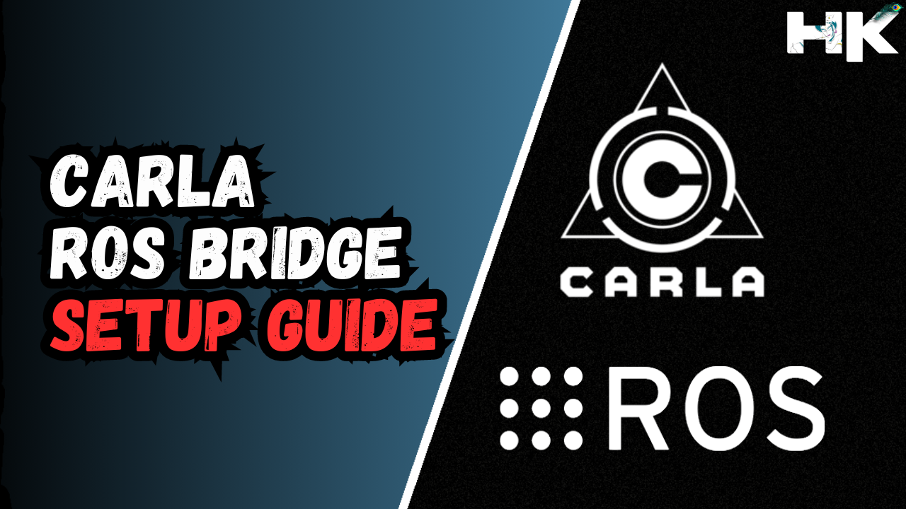

  

   

  

   

# ➡️ Introduction to Carla Simulator & Setup Guide

<h2>💠 What is Carla Simulator ? </h2>

The CARLA simulator is an open-source platform designed to support the development, training, and validation of autonomous driving systems. It provides a highly realistic and flexible simulation environment with customizable scenarios, built on Unreal Engine and OpenDRIVE. CARLA includes a range of features such as a sensor suite, traffic manager, and the ability to distribute workloads across multiple GPUs for enhanced performance. It's widely used for generating synthetic training data not only for autonomous vehicles but also for other robotics applications, simulating real-world urban and highway environments.

<h2>💠 Installation Prerequisites </h2>

1) **A compatible operating system:** You will need an **Ubuntu version that supports** the specific version of CARLA you wish to install. For instance, CARLA `0.9.13` is compatible with `ROS-bridge` as well as `ROS-Noetic`, which operates on `Ubuntu 20.04`.

2) **Operating System and GPU:** Ensure that your operating system meets the necessary specifications to run CARLA, including a compatible `GPU` that the CARLA simulator can utilize. ***Set up and update the required graphics drivers accordingly***. In my case, if you enter the command `nvidia-smi`, it will display my NVIDIA drivers.

3) **Clean and Fresh OS:** This installation guide is designed to assist with a from-scratch installation, which means starting with a clean slate,         
 `(1 and 2 Completed)`, then installing ROS, required libraries, and finally the CARLA simulator. It is ***advisable to begin with no pre-installed packages to avoid conflicts*** with the installation steps outlined in this guide.

# ➡️ Installation Phases

| Phase | Description |
| ----- | ----------- |
| **PHASE 1** | Install all basic/common libraries and `ROS Noetic` Setup. |
| **PHASE 2** | Installation of the `Carla Simulator`. |
| **PHASE 3** | Addressing any `errors` that may occur post-installation or during the initial run of Carla. |
| **PHASE 4** | Installation of the `ROS-Bridge`. |

# ➡️ PHASE 1 = Install all essential libraries and set up ROS Noetic.

The commands provided are useful for setting up a Linux-based development environment. They include updating the system, installing common tools and libraries, setting up Git, Python, and Visual Studio Code, and installing ROS Noetic. Although not all these steps are directly related to the CARLA simulator, they are necessary when configuring a fresh system to ensure that all dependencies and tools are in place for a smooth installation.

    #!/bin/bash
    
    # System setup
    echo "Update"
    yes | sudo apt-get update
    
    echo "Upgrade"
    yes | sudo apt-get upgrade
    
    echo "Installing Terminator"
    yes | sudo apt install terminator
    
    echo "Installing tmux"
    yes | sudo apt-get install tmux
    
    echo "Setting up SSH Server, net tools, GIT"
    yes | sudo apt-get install openssh-server net-tools git htop
    
    echo "Github Credential Save"
    git config --global credential.helper store
    
    echo "Installing pip and other python packages"
    yes | sudo apt install python3-pip 
    yes | pip3 install opencv-python
    yes | pip3 install numpy
    yes | pip3 install matplotlib
    yes | pip3 install pandas
    yes | pip3 install opencv-contrib-python
    yes | pip3 install scipy
    
    echo "Installing VSCode"
    wget -qO- https://packages.microsoft.com/keys/microsoft.asc | gpg --dearmor > packages.microsoft.gpg
    yes | sudo install -o root -g root -m 644 packages.microsoft.gpg /etc/apt/trusted.gpg.d/
    sudo sh -c 'echo "deb [arch=amd64,arm64,armhf signed-by=/etc/apt/trusted.gpg.d/packages.microsoft.gpg] https://packages.microsoft.com/repos/code stable main" > /etc/apt/sources.list.d/vscode.list'
    rm -f packages.microsoft.gpg
    yes | sudo apt install apt-transport-https
    sudo apt-get update
    yes | sudo apt install code # or code-insiders
    
    echo "Installing ROS Noetic"
    sudo sh -c 'echo "deb http://packages.ros.org/ros/ubuntu $(lsb_release -sc) main" > /etc/apt/sources.list.d/ros-latest.list'
    yes | sudo apt install curl # if you haven't already installed curl
    curl -s https://raw.githubusercontent.com/ros/rosdistro/master/ros.asc | sudo apt-key add -
    sudo apt-get update
    yes | sudo apt install ros-noetic-desktop-full
    
    sudo apt-get install -y ros-noetic-navigation ros-noetic-teb-local-planner* ros-noetic-ros-control ros-noetic-ros-controllers ros-noetic-gazebo-ros-control ros-noetic-ackermann-msgs ros-noetic-serial 
    
    sudo apt-get install -y ros-noetic-turtlebot3*
    sudo apt-get install -y ros-noetic-rosserial*
    sudo apt-get install -y ros-noetic-rosbridge-suite
    sudo pip3 install -U catkin_tools
    
    echo "source /opt/ros/noetic/setup.bash" >> ~/.bashrc
    source ~/.bashrc
    
    mkdir -p ~/catkin_ws/src
    cd ~/catkin_ws/
    catkin build

# ➡️ PHASE 2 = Installation of the `Carla Simulator`
For this phase, you should refer to the official documentation provided by the Carla Simulator, which has proven effective for all users.   Pay close attention and meticulously follow the instructions from the `Before you begin` section to `Running CARLA`.

    https://carla.readthedocs.io/en/0.9.13/start_quickstart/
    
If you run into any problems, especially when trying to run Carla, that's what PHASE 3 is for—to help fix those issues.

# ➡️ PHASE 3 = Addressing any `errors` that may occur post-installation or during the initial run of Carla.

In this phase, some individuals might encounter errors, whereas others might not, because errors do not occur universally. For a number of users, the process will be seamless from the start, but there will be cases where errors arise.    
To address this, we have outlined some common errors and their respective troubleshooting steps below, ensuring you have the guidance needed to resolve any issues that may come up while running Carla for the first time.

<h2>💠 <code> ERROR 1 ➞ Inadequate GPU Resources </code> </h2>

  

`SOLUTION` 
▸ Reinstall the graphics card drivers. 
▸ If already installed and Carla is not accessing them. 
▸ Ensure you install the correct driver version for your laptop. 

`About The Error`  

The error suggests a problem with the Vulkan graphics API on an AMD GPU, indicating insufficient memory to execute a command and a loss of the device connection (VK_ERROR_DEVICE_LOST), leading to a segmentation fault (Signal 11). This typically points to issues such as inadequate GPU resources, outdated drivers, or a hardware malfunction. Ensuring that your system meets CARLA's requirements, updating your graphics drivers, and checking resource availability could help resolve the problem.

<h2>💠 <code> ERROR 2 == Disable NVIDIA Vulkan Driver Permanently</code> </h2>

  

`SOLUTION` 
▸ Navigated to `/usr/share/vulkan/icd.d/` which is the directory where Vulkan ICD (Installable Client Driver) JSON files are located. 
▸ These files tell the Vulkan loader which drivers to load on the system. 
▸ The user lists the files in that directory and then moves the `nvidia_icd.json` file to `nvidia_icd.json.backup` ***effectively disabling the NVIDIA Vulkan driver.***  

<h2>💠 <code> ERROR 3 == When "./CarlaUE4.sh -opengl" FAILS</code> </h2>

  

`About The Error`  
▸ The use of the `-opengl` flag is intended to tell the application to use the OpenGL rendering engine instead of Vulkan. This can sometimes resolve issues related to Vulkan, especially if there are driver or compatibility problems with Vulkan on the system.  

▸ However, in the screenshots I provided, attempting to run the CARLA simulator with the `-opengl` flag did not seem to fix the issue; the same X Error of failed request: BadMatch (invalid parameter attributes) error was still occurring.  

▸ This suggests that the issue may not be with the graphics API specifically, but could be related to other configuration mismatches or issues between the application and the X server settings.

`SOLUTION` 
▸ The command `export VK_ICD_FILENAMES="/usr/share/vulkan/icd.d/nvidia_icd.json"` is used to set the `VK_ICD_FILENAMES` environment variable to point to the Nvidia Vulkan Installable Client Driver (ICD) configuration file. This tells the Vulkan loader to use the Nvidia driver for Vulkan support.

▸ After setting this environment variable, the user then runs the CARLA simulator with the script ./CarlaUE4.sh. The use of && suggests that the simulator will only run if the export command succeeds.

▸ The purpose of setting this variable might be to resolve a driver conflict or to force the application to use a specific graphics driver, particularly if there are multiple drivers installed on the system that could potentially handle Vulkan.

  

<h2>💠 <code> ERROR 4 == No Module Named Carla</code> </h2>

  

`SOLUTION` 
▸ Add path to .bashrc -> `export PYTHONPATH=~/CARLA_0.9.13/PythonAPI/carla/dist/carla-0.9.12-py3.7-linux-x86_64.egg:$PYTHONPATH`  
▸ Check working directory  
▸ Source bashrc file  

<h2>💠 <code>No Error == Launch Successfull</code> </h2>

  

# ➡️ PHASE 4 = Installation of the <code>ROS Bridge</code>

After clearing all the errors, and confirming that the simulator is running smoothly, you should be able to launch 'python3 generate_traffic.py' without any issues. If you encounter any errors with the simulator in phase 2, please resolve them before proceeding. Do not proceed if you still have errors.

Now, for the last step, we need to connect your Carla simulator with ROS. This can be achieved by installing the ROS Bridge for Carla. The following link provides straightforward instructions from the official documentation, making the installation process easy:

    https://carla.readthedocs.io/projects/ros-bridge/en/latest/run_ros/#using-the-ros-bridge-in-synchronous-mode
    
Please follow the instructions in the provided link to install the ROS Bridge for Carla.

<h2>💠 <code>ERROR == numpy.bool or np.bool error in camera.py</code> </h2>

After installing ROS Bridge, when launching the 'rosbridge' or 'spawnobjects' launch files, you may or may not encounter an error. If you do encounter an error, the issue will likely be in the 'camera.py' script located in the 'rosbridge' Catkin workspace.   

`PATH to camera.py`  
/home/your_user_name/carla-ros-bridge/install/carla_ros_bridge/lib/python3.8/site-packages/carla_ros_bridge

`SOLUTION` 
To resolve this, open the `camera.py` file and, at the end of the file, replace `numpy.bool` with `numpy.bool_`.

  

  

