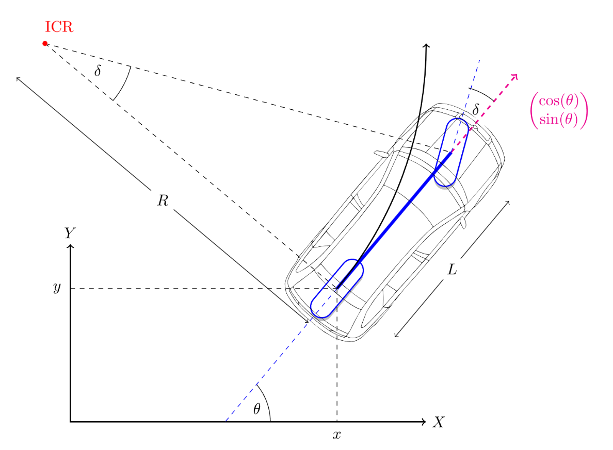

5 𝘮𝘪𝘯𝘶𝘵𝘦 𝘳𝘦𝘢𝘥 📚 
  

<!------ PROJECT TITLE ------>

    

    

<!------ WHAT ------>

    

<h1>🎀 Essence of the Project</h1>

The Bicycle Kinematic Model block creates a bicycle vehicle model to simulate simplified car-like vehicle dynamics, representing a vehicle with two axles defined by the length between the axles, known as the `wheel base. The vehicle's heading, theta, is defined at the center of the rear axle, where the front wheel can be steered using an angle psi.  
    
This kinematic approach is fundamental in <strong>autonomous driving vehicles</strong> and <strong>autonomous mobile robotics</strong>, enabling accurate motion planning and control by predicting vehicle trajectory and facilitating the implementation of advanced navigation algorithms. 
  

    

   
  

<!------ WHY ------>

    

<h1>🎯 Project Vision</h1>

▸ The Bicycle Kinematic Model is pivotal in autonomous driving and robotics for planning and executing precise movements and maneuvers.

▸ It simplifies complex vehicle dynamics into a manageable model that captures the essential aspects of steering and motion, enabling the prediction of vehicle trajectory based on steering commands.

▸ This model is especially useful in path planning and control algorithms, where it helps in predicting the future position of the vehicle or robot, ensuring smooth navigation and adherence to desired paths or trajectories.

▸ The kinematic bicycle model facilitates an intuitive understanding of how vehicles respond to steering inputs, crucial for the design and optimization of autonomous driving algorithms.

<!------ HOW ------>

    

<h2>🪓Project Implementation</h2>

ADD HERE

