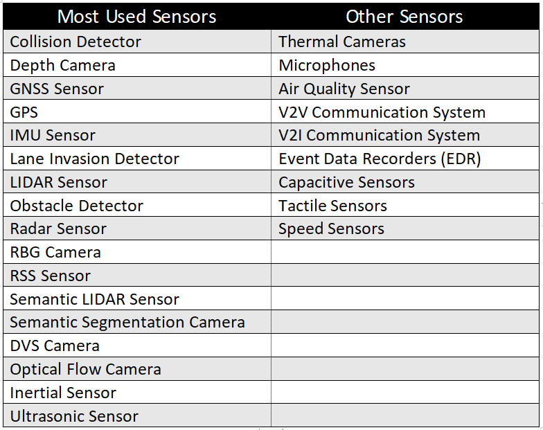

1 𝘮𝘪𝘯𝘶𝘵𝘦 𝘳𝘦𝘢𝘥..

# 🔻 What is Carla Simulator?

▸ The CARLA simulator is a robust <strong>self-driving vehicle simulation</strong> developed using the Unreal Engine, aimed at crafting highly authentic virtual training and validation environments for <stgrong>autonomous driving systems</stgrong>. The platform grants access to a wide range of digital assets including urban layouts, buildings, and vehicles, all designed for free and open use.
  

    

▸ Carla simulator offers a spectrum of extreme weather conditions such as rain, fog, storms for rigorous perception tests.

▸ Traffic patterns reflecting true-to-life situations from crowded city streets and high-speed country roads to unpredictable highway traffic and nocturnal driving conditions.

▸ Scenarios for critical response training, including unexpected roadblocks, vehicle breakdowns, and unpredictable actions from pedestrians and other drivers.

# 🔻Repository Detail

This repository documents my comprehensive journey through diverse projects in Autonomous Driving using the Carla Simulator. Each project carefully addresses distinct challenges within autonomous systems, demonstrating the thorough application and exceptional efficacy of techniques such as deep learning, motion control, and motion planning in processing and comprehending intricate self-driving car data.

# 🔻 Basics are key❗️

 I understand your excitement to download these projects and start running them immediately. However, doing so won't be very beneficial. If you truly want to build and train autonomous systems, it's essential to have a basic understanding of sensors technology, robotics, in-depth knowledge of computer vision, and the fundamentals of self-driving cars. Below are some of my recommendations and a roadmap that I've created, along with a highly valuable free YouTube course.

  <table align="center">
    <tr>
      <td align="center"><b style="font-size:54px;">Route Map</b></td>
    </tr>
    <tr>
      <td align="center"></td>
    </tr>
    <tr>
      <td align="center"><b style="font-size:54px;">Sensors Technology</b></td>
    </tr>
    <tr>
      <td align="center"></td>
    </tr>
  </table>

## Free Valuble Youtube Course

<table>
<tr>
<th>Professor</th>
<th>Series</th>
</tr>
<tr>
<td>Prof. Andreas Geiger, University of Tübingen</td>
<td></td>
</tr>
</table>

 

    

