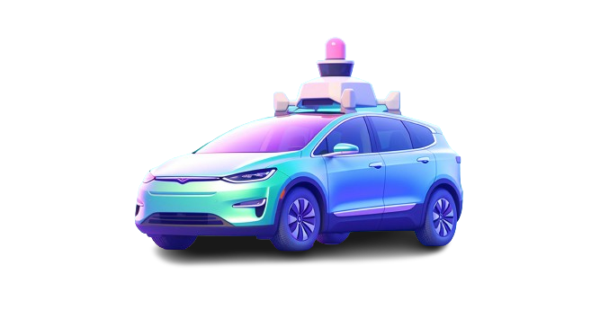
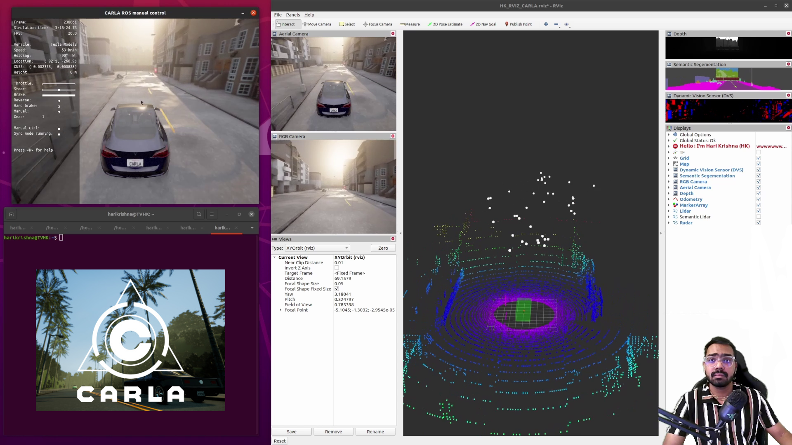
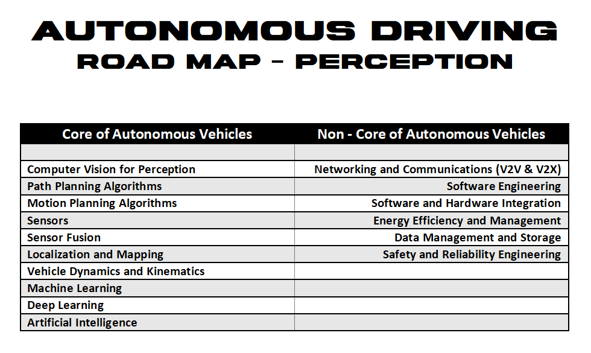

© 𝗗𝗼𝗰𝘂𝗺𝗲𝗻𝘁𝗮𝘁𝗶𝗼𝗻 𝗯𝘆 𝘁𝘃𝗵𝗮𝗿𝗶𝗸𝗿𝗶𝘀𝗵𝗻𝗮

1 𝘮𝘪𝘯𝘶𝘵𝘦 𝘳𝘦𝘢𝘥 📚 

# 🔻 What is a Self-Driving Vehicle?

A <strong>self-driving vehicle</strong>, also known as an autonomous vehicle, is a car or truck equipped with technology that enables it to navigate and operate without human input. These vehicles utilize sensors, cameras, radar, and artificial intelligence to perceive their surroundings and make decisions to safely reach their destination, transforming the concept of driving and mobility. 

    

# 🔻 What is Carla Simulator?

▸ The CARLA simulator is a robust <strong>self-driving vehicle simulation</strong> developed using the Unreal Engine, aimed at crafting highly authentic virtual training and validation environments for <stgrong>autonomous driving systems</stgrong>. The platform grants access to a wide range of digital assets including urban layouts, buildings, and vehicles etc. 

    

▸ Carla simulator offers a spectrum of extreme weather conditions such as rain, fog, storms for perception tests.

▸ Traffic patterns reflecting true-to-life situations from crowded city streets and high-speed country roads to unpredictable driving conditions.

▸ Scenarios for critical response training, including unexpected roadblocks and unpredictable actions from pedestrians and other drivers.

# 🔻 Repository Detail

This repository documents my comprehensive journey through diverse projects in Autonomous Driving using the Carla Simulator. Each project carefully addresses distinct challenges within autonomous systems, demonstrating the thorough application and exceptional efficacy of techniques such as deep learning, motion control, and motion planning in processing and comprehending intricate self-driving car data.

# 🔻 Basics are key❗️

 I understand your excitement to download these projects and start running them immediately. However, doing so won't be very beneficial. If you truly want to build and train autonomous systems, it's essential to have a basic understanding of sensors technology, robotics, in-depth knowledge of computer vision, and the fundamentals of self-driving cars. Below are some of my recommendations I created.

    

### 💠 Sensors for Autonomous Vehicles

| Most Used Sensors         | Other Sensors                 |
|---------------------------|-------------------------------|
| Collision Detector        | Thermal Cameras               |
| Depth Camera              | Microphones                   |
| GNSS Sensor               | Air Quality Sensor            |
| GPS                       | V2V Communication System      |
| IMU Sensor                | V2I Communication System      |
| Lane Invasion Detector    | Event Data Recorders (EDR)    |
| LIDAR Sensor              | Capacitive Sensors            |
| Obstacle Detector         | Tactile Sensors               |
| Radar Sensor              | Speed Sensors                 |
| RBG Camera                |                               |
| RSS Sensor                |                               |
| Semantic LIDAR Sensor     |                               |
| Semantic Segmentation Camera |                             |
| DVS Camera                |                               |
| Optical Flow Camera       |                               |
| Inertial Sensor           |                               |
| Ultrasonic Sensor         |                               |

# 🔻 Free Valuble Youtube Course

<table>
<tr>
<th>Professor</th>
<th>Series</th>
</tr>
<tr>
<td>Prof. Andreas Geiger, University of Tübingen</td>
<td></td>
</tr>
</table> 

 
 

    

